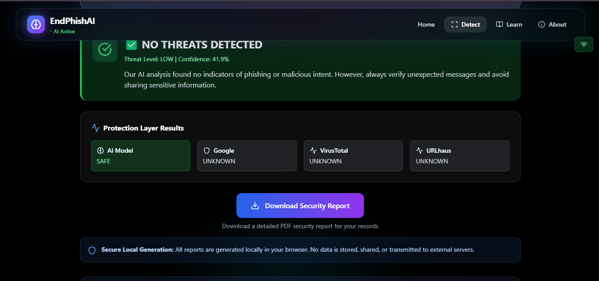
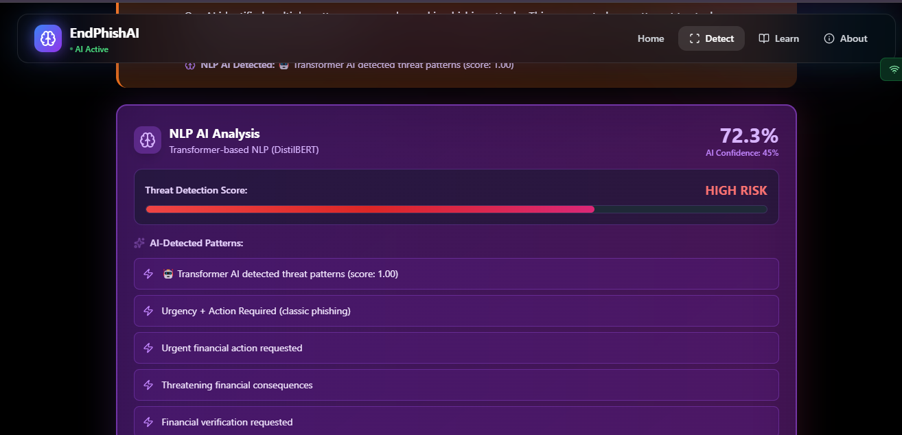
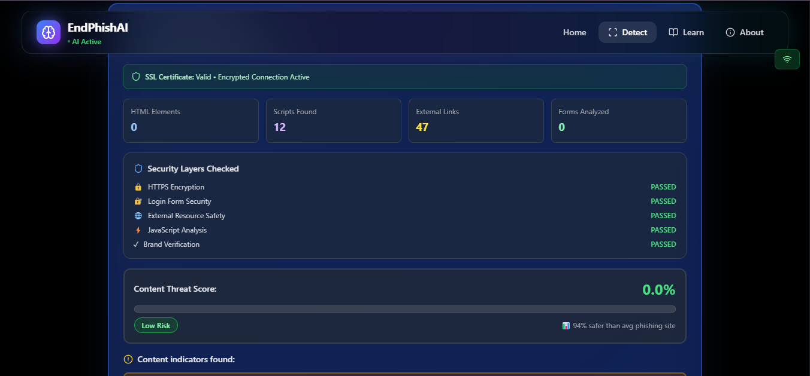
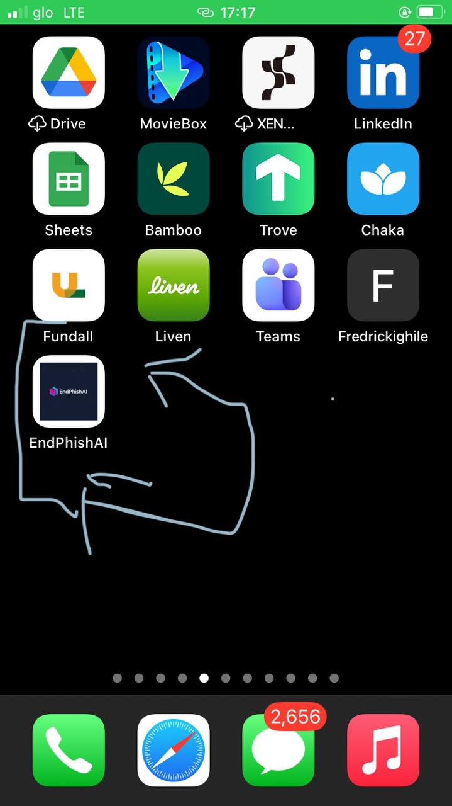
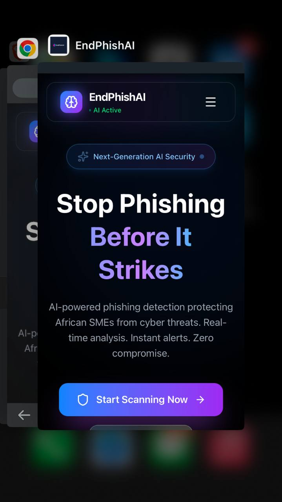
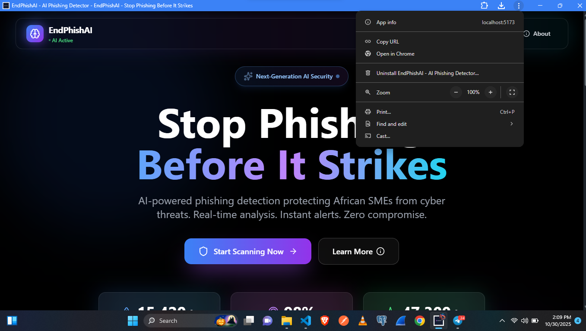
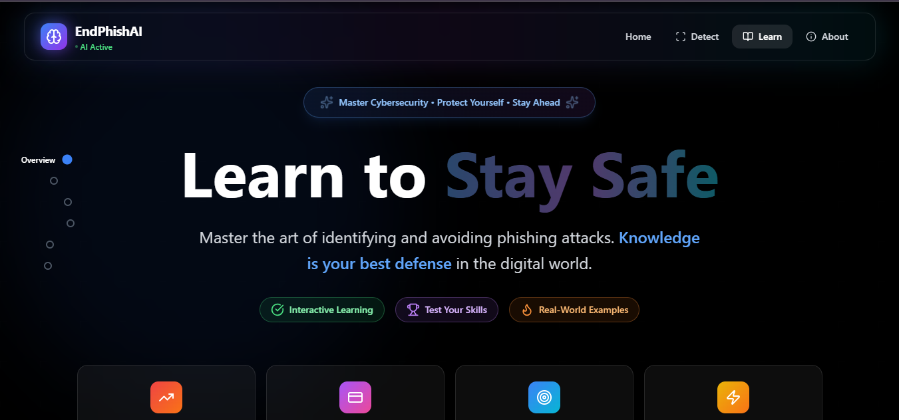
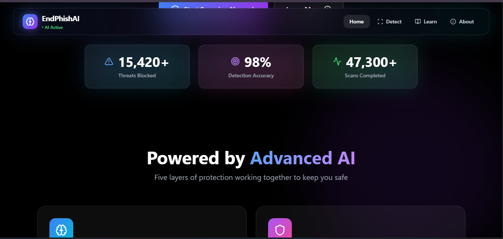
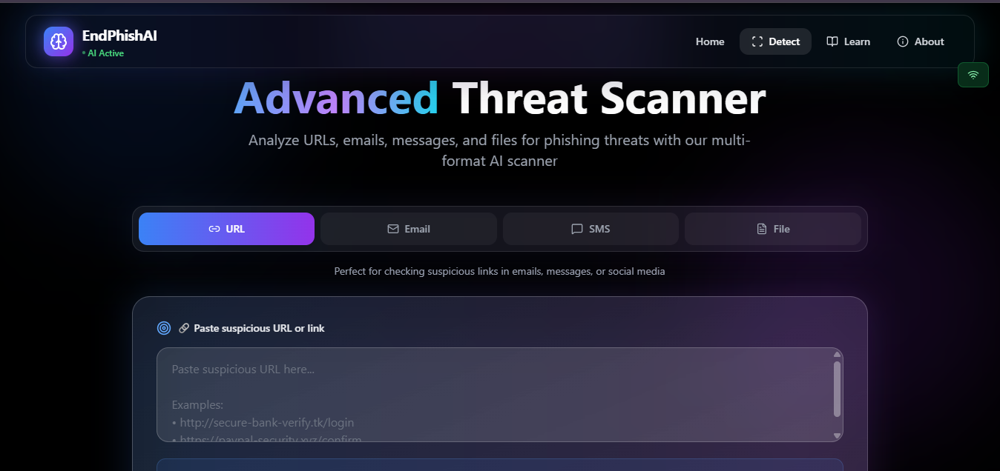
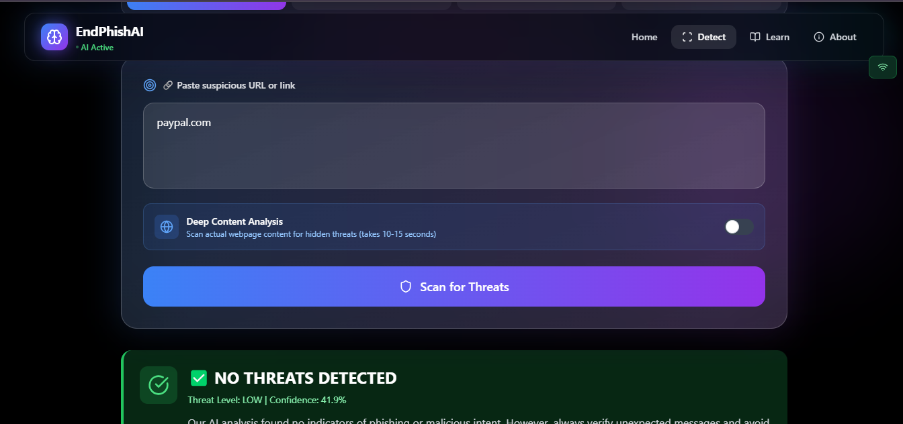

# EndPhishAI — AI-Powered Phishing Detection

**Fredrick Ighile** | [github.com/Fredrickighile](https://github.com/Fredrickighile) | [linkedin.com/in/fredrick-ighile](https://linkedin.com/in/fredrick-ighile)

🏆 **Top 3 Finalist — AfriHackBox Pan-African Cybersecurity Hackathon 2025**

🎥 **[Watch Demo on YouTube](https://youtu.be/NxFSRwz2bs8?si=0_rCLe1c8RtBqpJI)**

---

## Table of Contents

1. [Why I Built This](#why-i-built-this)
2. [What It Does](#what-it-does)
3. [How It Works](#how-it-works)
4. [The 6-Layer Detection System](#the-6-layer-detection-system)
5. [ML Model Performance](#ml-model-performance)
6. [NLP Text Analysis](#nlp-text-analysis)
7. [Deep Content Analysis](#deep-content-analysis)
8. [Mobile-First PWA](#mobile-first-pwa)
9. [Security Education Module](#security-education-module)
10. [African Context](#african-context)
11. [Why It Works Better](#why-it-works-better)
12. [Tech Stack](#tech-stack)
13. [Setup](#setup)
14. [Screenshots](#screenshots)

---

## Why I Built This

I lost money to a phishing scam. I felt helpless, frustrated, and angry. That pain became my purpose.

I'm not just a developer building a hackathon project. I'm a victim turned fighter. I know the fear of clicking a fake link. I know the shame of falling for a scam.

EndPhishAI exists because no one should suffer what I did.

---

## What It Does

EndPhishAI detects phishing across four input types:

- **URLs** — scan any suspicious link, results in 1-3 seconds
- **Emails** — paste the full email content for analysis
- **SMS** — check text messages for smishing attacks
- **Files** — upload PDF, DOCX, TXT, CSV, or HTML files

It explains what it found and why — not just "threat detected" but "this URL is impersonating PayPal using character substitution (paypa1.com) and contains a credential harvesting form."

The project also includes an interactive security education module — a quiz that teaches users to recognize phishing patterns themselves, because detection tools alone aren't enough.

---

## How It Works

```
User submits URL / Email / SMS / File
              │
              ▼
    6 detection layers run in parallel
              │
    ┌─────────┴──────────┐
    ▼                    ▼
ML + NLP Analysis    External APIs
(Local, fast)        (GSB, VirusTotal,
                      PhishTank, URLhaus)
              │
              ▼
    Combined verdict:
    Safe / Suspicious / Phishing
    + Plain-English explanation
    + Recommended action
```

---

## The 6-Layer Detection System

Most tools use one method — usually a database lookup. EndPhishAI uses six layers simultaneously. If any single layer flags something suspicious, the user gets warned.

```
Layer 1 — Advanced Heuristics
  URL structure, keywords, brand impersonation patterns,
  suspicious TLDs, character substitution detection

Layer 2 — Machine Learning (Random Forest)
  Trained on 2,852 samples, 2,164 engineered features
  99.2% cross-validation accuracy

Layer 3 — NLP Text Analysis (DistilBERT + Keywords)
  Sentiment analysis, urgency detection,
  100+ phishing terms across 5 languages

Layer 4 — Google Safe Browsing
  Real-time threat intelligence

Layer 5 — VirusTotal
  70+ antivirus engine consensus

Layer 6 — PhishTank + URLhaus
  Community-maintained threat databases
```

This layered approach is specifically designed to catch zero-day phishing sites — attacks that haven't been added to any database yet — which is where most tools fail.



---

## ML Model Performance

**Algorithm:** Random Forest Classifier with XGBoost alternative

**Training data:** 2,852 samples — 1,344 phishing, 1,508 safe

**Features:** 2,164 total
- 35 handcrafted forensic features (URL structure, domain entropy, security indicators)
- 2,129 TF-IDF features (tri-gram analysis, multilingual keyword detection)

**Results:**

| Metric | Result |
|---|---|
| Cross-validation accuracy | 99.2% (5-fold stratified) |
| Test set accuracy | 100% (571 samples) |
| False positive rate | < 1% |
| Response time | 1-3 seconds |

We report cross-validation accuracy as the primary metric — it's more conservative and more representative of real-world performance than a single test set result.

**35 Forensic Features include:**
- URL structure analysis (hyphens, dots, slashes, special characters)
- Domain complexity metrics (length, entropy, suspicious TLDs)
- Security indicators (HTTPS, ports, IP addresses)
- Linguistic patterns (urgency keywords, brand impersonation)

**2,129 TF-IDF Features include:**
- Tri-gram analysis (1-3 word combinations)
- Multilingual keyword detection (5 African languages)
- Context-aware tokenization

---

## NLP Text Analysis

Email and SMS scanning uses a two-component approach:

**DistilBERT (pre-trained transformer)**
Detects negative sentiment patterns — threats, urgency, fear tactics. Research shows 87%+ of phishing messages use negative sentiment to pressure victims.

**Keyword analysis**
100+ phishing terms across English, French, Swahili, Yoruba, and Hausa — covering the specific language patterns used in African phishing campaigns.

**Example:**
```
Input: "URGENT! Your M-Pesa account suspended. Verify now!"

Sentiment:  NEGATIVE — threats detected
Keywords:   urgency + action_required + financial
Result:     87% phishing probability
```



---

## Deep Content Analysis

When Deep Scan is enabled, EndPhishAI actually visits the webpage and examines:

- HTTPS encryption status
- Login forms and password field harvesting
- External links and redirect chains
- Hidden iframes and embedded content
- Suspicious JavaScript patterns
- Brand impersonation (PayPal, bank clones, M-Pesa)
- Urgency language in page content
- Page structure comparison against legitimate sites

This catches new phishing sites that haven't been reported yet — the ones that slip through every database check.



---

## Mobile-First PWA

EndPhishAI was built for Africa's mobile-first reality where 600M+ people access the internet primarily on smartphones. It's a fully installable Progressive Web App — no app store required.

**Install on Android (Chrome):**
1. Visit EndPhishAI on Chrome
2. Tap "Add to Home Screen" banner at bottom
3. EndPhishAI icon appears on your home screen

**Install on iPhone (Safari):**
1. Visit EndPhishAI on Safari
2. Tap the Share button
3. Scroll down → "Add to Home Screen"

**What works offline:**
- Heuristic pattern detection
- Cached ML model for basic analysis
- Last 10 scan history
- Security education content
- Auto-syncs when connection restored

**Optimized for basic devices:**
- Works on 1-2GB RAM phones
- 2G/3G friendly — minimal data usage
- Under 5MB total size
- Responsive on any screen size

### PWA in Action

| Screenshot | Description |
|---|---|
|  | Installed on home screen — appears like a native app |
|  | Launch screen on mobile |
|  | Desktop mode |

---

## Security Education Module

Most security tools detect threats and stop there. EndPhishAI teaches users to recognize phishing themselves.

**Interactive Quiz — 10 real-world scenarios:**
- "Your bank account will be closed in 24 hours!" — Phishing or Real?
- "www.paypa1.com" vs "www.paypal.com" — Can you spot the difference?
- "You won $50,000! Click here!" — Red flag or legit?

**Streak system** — get answers right in a row and build your streak.

The goal is behavior change, not just blocking. If users can recognize phishing themselves, they're protected even when the tool isn't available.



---

## African Context

Phishing in Africa looks different from phishing in North America or Europe. The attacks target mobile money platforms, local banks, and telecoms — using local languages and culturally familiar urgency tactics.

EndPhishAI was specifically trained on:
- M-Pesa fake verification SMS ("Thibitisha akaunti yako haraka!")
- GTBank and other Nigerian bank login clones
- MTN and Airtel account suspension scams
- Mobile money fraud targeting trust-based transactions

**Languages supported:** English, French, Swahili, Yoruba, Hausa

Most phishing detection tools are trained entirely on English-language threats from Western contexts. They miss African attacks. That gap is what EndPhishAI addresses.

---

## Why It Works Better

| Feature | Most Tools | EndPhishAI |
|---|---|---|
| Detection method | Only checks known threats | AI + real-time content analysis |
| Formats supported | URLs only | URLs, Emails, SMS, Files |
| Speed | 5-10 seconds | 1-3 seconds (10-15 deep scan) |
| Accuracy | 85-90% | 99.2% |
| African context | None | Trained on local threats |
| Education | None | Interactive quiz |
| Explainability | "Threat detected" | Explains exactly why it's dangerous |
| Mobile support | Desktop only | PWA + offline mode |
| Zero-day detection | No | Yes |

---

## Tech Stack

**Frontend**
- React 18 + Vite
- Tailwind CSS
- React Router
- Recharts
- PWA (Service Workers + Web App Manifest)

**Backend — Python**
- Flask REST API
- scikit-learn + XGBoost
- DistilBERT (Hugging Face Transformers)
- NLTK

**Backend — Node.js**
- Express.js
- Twilio SDK (SMS alerts)

**APIs**
- Google Safe Browsing
- VirusTotal
- PhishTank
- URLhaus

---

## Setup

**Prerequisites:** Python 3.10+, Node.js 16+

**1. Clone**
```bash
git clone https://github.com/Fredrickighile/endphishai.git
cd endphishai
```

**2. Python backend**
```bash
cd phishai
pip install -r requirements.txt
python model_training.py    # First time only — trains the ML model
python app.py               # Runs on http://127.0.0.1:8000
```

**3. React frontend**
```bash
cd frontend
npm install
npm run dev                 # Runs on http://localhost:5173
```

**4. Try it out**

Paste this fake URL: `http://paypa1.com/verify` (notice the "1" instead of "l") and watch EndPhishAI catch it in 1-3 seconds.

**5. Optional: API keys for full detection power**

Create `phishai/.env`:
```bash
GOOGLE_API_KEY=your_google_safe_browsing_key
VIRUSTOTAL_API_KEY=your_virustotal_key
```

Create `backend/.env`:
```bash
TWILIO_ACCOUNT_SID=your_twilio_sid
TWILIO_AUTH_TOKEN=your_twilio_token
TWILIO_PHONE_NUMBER=+1234567890
```

Free tier keys at:
- Google Safe Browsing: developers.google.com/safe-browsing
- VirusTotal: virustotal.com/gui/join-us
- Twilio: twilio.com/try-twilio

The app works without API keys using the ML model only.

---

## Screenshots

**Landing page**



**Detection interface**



**PayPal phishing detected**



**NLP analysis result**


**Deep content analysis**


**Security education module**


---

*Built for AfriHackBox Pan-African Cybersecurity Hackathon 2025. Top 3 finalist.*

**Fredrick Ighile** | [github.com/Fredrickighile](https://github.com/Fredrickighile)
