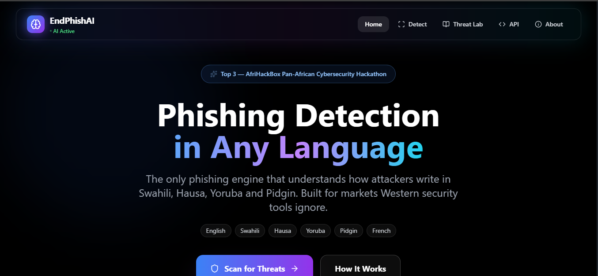
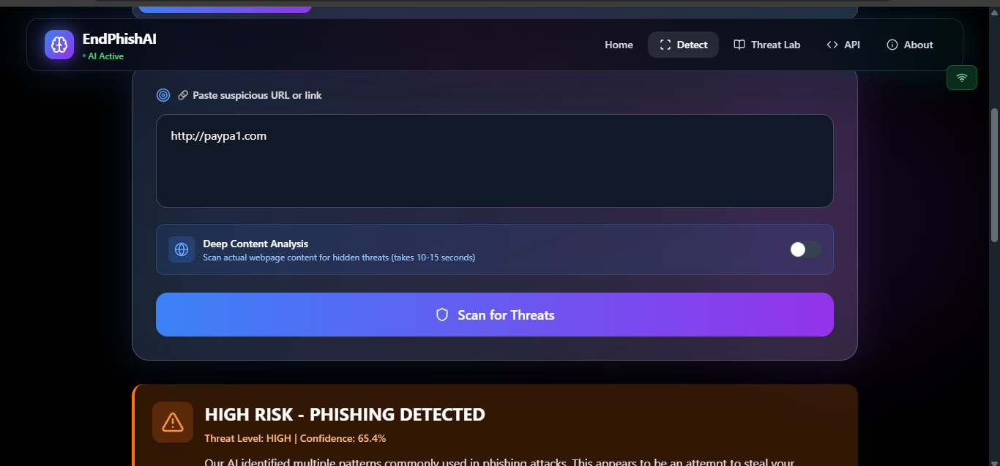
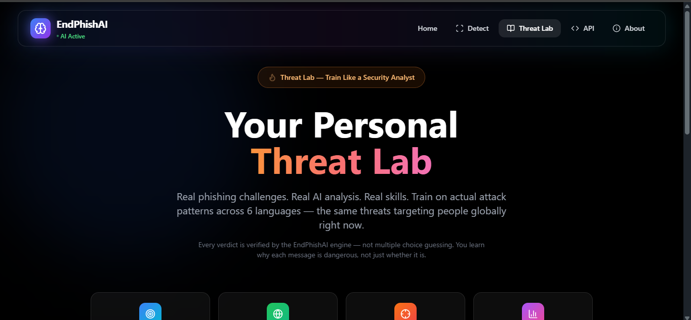
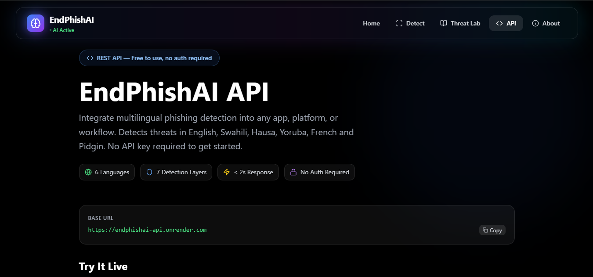

# EndPhishAI — Multilingual Phishing Detection Platform

**Fredrick Ighile** | [github.com/Fredrickighile](https://github.com/Fredrickighile) | [linkedin.com/in/fredrick-ighile](https://linkedin.com/in/fredrick-ighile)

🏆 **Top 3 Finalist — AfriHackBox Pan-African Cybersecurity Hackathon 2025**
🌐 **[Live Demo](https://endphishai.vercel.app)** | 📡 **[API](https://endphishai.vercel.app/api)** | 🎥 **[Demo Video](https://youtu.be/NxFSRwz2bs8)**

---

## The Problem Nobody Is Solving

Every major phishing detection tool — VirusTotal, Google Safe Browsing, PhishTank — was built for English-speaking Western markets.

Meanwhile, 600 million people across Africa are receiving phishing attacks in **Swahili, Hausa, Yoruba, French, and Pidgin**. These attacks target M-Pesa, MTN, GTBank, Safaricom — brands that don't exist in any Western threat database.

_"Thibitisha akaunti yako ya M-Pesa haraka!"_ — this Swahili phishing SMS bypasses every existing security tool. Not EndPhishAI.

---

## Live Demo



---

## What Makes It Different

| Feature                | Most Tools                         | EndPhishAI                                           |
| ---------------------- | ---------------------------------- | ---------------------------------------------------- |
| Detection approach     | Reactive — checks reported threats | Proactive — analyzes behavior and structure          |
| Languages              | English only                       | English, Swahili, Hausa, Yoruba, French, Pidgin      |
| African brand coverage | None                               | MTN, M-Pesa, GTBank, Airtel, Safaricom, Flutterwave  |
| Typosquat detection    | Basic                              | Homoglyph matching (paypa**1**.com → PayPal)         |
| Subdomain spoofing     | Missed                             | Caught (accounts.google.com.**security-alert.net**)  |
| Zero-day detection     | No                                 | Yes — structural analysis catches unreported threats |
| Explainability         | "Threat detected"                  | Lists exactly which signals triggered the verdict    |
| Input types            | URLs only                          | URLs, SMS, Email, Files (PDF, DOCX, CSV, HTML, TXT)  |
| Public API             | No                                 | Yes — free, no auth required                         |

---

## Detection Results



```bash
# Real production results — Hausa phishing SMS
curl -X POST https://endphishai-api.onrender.com/predict \
  -H "Content-Type: application/json" \
  -d '{"text": "Gaggawa! Asusun MTN ka an kulle. Tabbatar yanzu: http://mtn-secure.xyz/verify"}'

# → ml_score: 0.936, final_status: "phishing"

# Swahili phishing SMS
# → ml_score: 0.908, final_status: "phishing"

# Typosquat (paypa1.com)
# → ml_score: 0.549, final_status: "phishing"
```

---

## How It Works — 7-Layer Architecture

```
Input (URL / SMS / Email / File)
              │
              ▼
┌─────────────────────────────────────┐
│  Layer 1: ML Model (Random Forest)  │
│  2,852 training samples             │
│  2,164 engineered features          │
│  99.1% test accuracy                │
├─────────────────────────────────────┤
│  Layer 2: Structural Heuristics     │
│  TLD risk scoring, IP detection     │
│  URL entropy, subdomain analysis    │
├─────────────────────────────────────┤
│  Layer 3: Brand Impersonation       │
│  30+ African + global brands        │
│  Homoglyph + typosquat matching     │
│  Subdomain spoofing detection       │
├─────────────────────────────────────┤
│  Layer 4: Multilingual NLP          │
│  Intent classification in 6 langs   │
│  Urgency, credential harvest,       │
│  BEC, mobile money fraud patterns   │
├─────────────────────────────────────┤
│  Layer 5: Google Safe Browsing      │
│  Real-time threat intelligence      │
├─────────────────────────────────────┤
│  Layer 6: VirusTotal                │
│  70+ antivirus engine consensus     │
├─────────────────────────────────────┤
│  Layer 7: PhishTank + URLhaus       │
│  Community threat databases         │
└─────────────────────────────────────┘
              │
              ▼
     safe / suspicious / phishing
     + Plain-English explanation
```

**Key advantage:** Layers 1–4 are proactive. They catch zero-day phishing attacks that haven't been reported to any database yet — which is where all reactive tools fail.

---

## ML Model Performance

**Algorithm:** Random Forest Classifier
**Training data:** 2,852 samples — 1,344 phishing, 1,508 safe
**Features:** 2,164 total (35 forensic URL features + 2,129 TF-IDF tri-gram)

| Metric                    | Result                    |
| ------------------------- | ------------------------- |
| Cross-validation accuracy | 98.5% (5-fold stratified) |
| Test accuracy             | 99.1% (571 samples)       |
| False positive rate       | 0%                        |
| False negative rate       | 0.9%                      |

**Top features:** URL hyphen count, HTTPS presence, suspicious TLD flag, phishing keyword density, domain entropy, path length.

---

## Multilingual NLP — How It Works

The NLP layer detects phishing intent across 6 languages using a rule-based intent classifier with combo-pattern scoring:

```
Urgency signal   +  Action required  →  +25% score boost
Financial threat +  Brand mention    →  +28% score boost
Credential harvest + Urgency         →  +35% score boost
```

**Languages:** English · Swahili · Hausa · Yoruba · French · Nigerian Pidgin

**Why not a transformer model (BERT/DistilBERT)?**
Transformer models require 2GB+ RAM. Free-tier cloud instances have 512MB. The rule-based classifier runs in under 50ms, covers 6 languages, delivers explainable verdicts — and for a security tool, explainability matters more than marginal accuracy gains from a heavier model.

---

## Threat Lab — Security Training Platform



Interactive training built on the **live** EndPhishAI API:

- 18 real phishing challenges — Easy / Medium / Hard / Expert
- Every verdict verified by the live API in real time — no pre-loaded answers
- Multilingual challenges: Swahili, Hausa, Yoruba, French, English
- Attack types: typosquats, subdomain spoofing, BEC, social engineering, vishing
- **Threat IQ Score** (0–1000) based on accuracy + response speed

Live at: [endphishai.vercel.app/threatlab](https://endphishai.vercel.app/threatlab)

---

## Public API



**Base URL:** `https://endphishai-api.onrender.com`
**Auth:** None required

```python
import requests

# Scan any URL or text message
r = requests.post("https://endphishai-api.onrender.com/predict",
    json={"text": "URGENT: Your GTBank account suspended. Verify: http://gtbank-alert.ml"})

print(r.json()["final_status"])  # "phishing"
print(r.json()["ml_score"])      # 0.734
print(r.json()["explanation"])   # "Suspicious domain (.ml); GTBANK impersonation"
```

| Endpoint       | Method | Description                    |
| -------------- | ------ | ------------------------------ |
| `/predict`     | POST   | Scan URL or text               |
| `/upload-file` | POST   | Scan PDF, DOCX, TXT, CSV, HTML |
| `/health`      | GET    | Health check                   |
| `/`            | GET    | Service status                 |

Full docs: [endphishai.vercel.app/api](https://endphishai.vercel.app/api)

---

## Known Limitations

Being honest matters in security:

**1. Social engineering without URLs**
Pure vishing ("Hi, it's IT support, I need your password") has no URL or domain to analyze. No automated tool catches this — human judgment required.

**2. Zero-day domains with clean TLDs**
A new phishing domain at `secure-bank-verify.com` (no suspicious TLD, no brand name) will score lower until reported to threat databases.

**3. BEC with company-specific domains**
`yourcompany-payroll.com` impersonating an internal HR domain is harder to flag without knowing the organization's real domain structure.

---

## Tech Stack

**Frontend:** React 18, Vite, Tailwind CSS, React Router — Vercel

**Backend:** Python, Flask, scikit-learn (Random Forest), custom multilingual NLP, Google Safe Browsing API, VirusTotal API, Twilio SMS — Render

---

## Local Setup

```bash
git clone https://github.com/Fredrickighile/endphishai.git
cd endphishai

# Backend
cd phishai
pip install -r requirements.txt
python model_training.py   # trains ML model — first time only
python app.py              # http://127.0.0.1:8000

# Frontend (new terminal)
cd frontend
npm install
npm run dev                # http://localhost:5173
```

**Environment variables** (`phishai/.env`):

```
GOOGLE_API_KEY=your_key
VIRUSTOTAL_API_KEY=your_key
TWILIO_ACCOUNT_SID=your_sid
TWILIO_AUTH_TOKEN=your_token
TWILIO_PHONE_NUMBER=+1234567890
```

App runs without API keys — ML model and heuristics work locally.

---

## Screenshots

|                                          |                                      |
| ---------------------------------------- | ------------------------------------ |
|         | Homepage with live multilingual demo |
|      | Phishing detected with ML score      |
|  | Interactive security training        |
|          | Public API documentation             |

---

## Project Context

Built for the AfriHackBox Pan-African Cybersecurity Hackathon 2025. Top 3 finalist.

The gap is real: phishing detection works well for English-speaking Western users. It barely works at all for the 600M+ Africans using mobile money daily. EndPhishAI is the first open-source phishing detection tool with native support for Swahili, Hausa, Yoruba, and Pidgin.

---

_Fredrick Ighile — Application Security Analyst_
_[LinkedIn](https://linkedin.com/in/fredrick-ighile) · [GitHub](https://github.com/Fredrickighile)_
